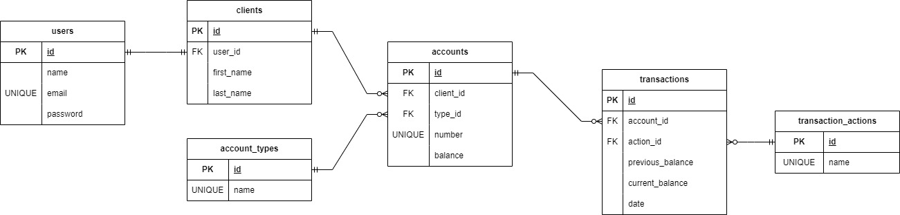
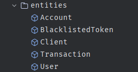
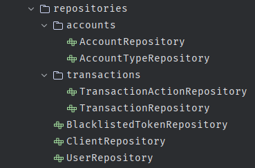
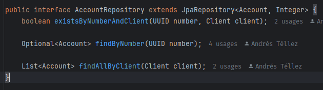
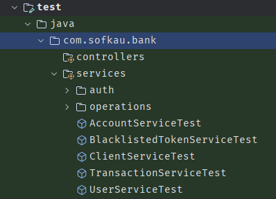
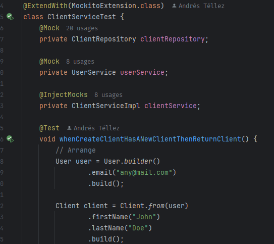
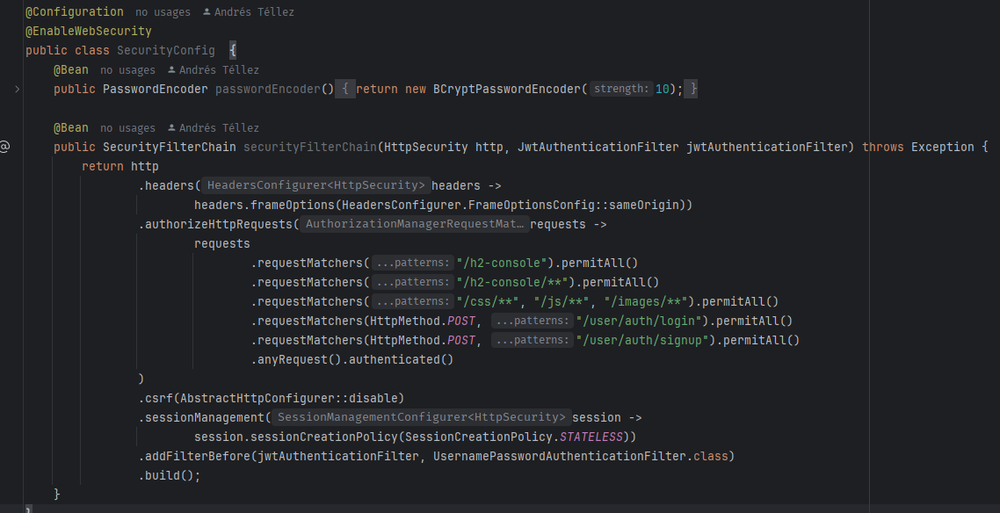
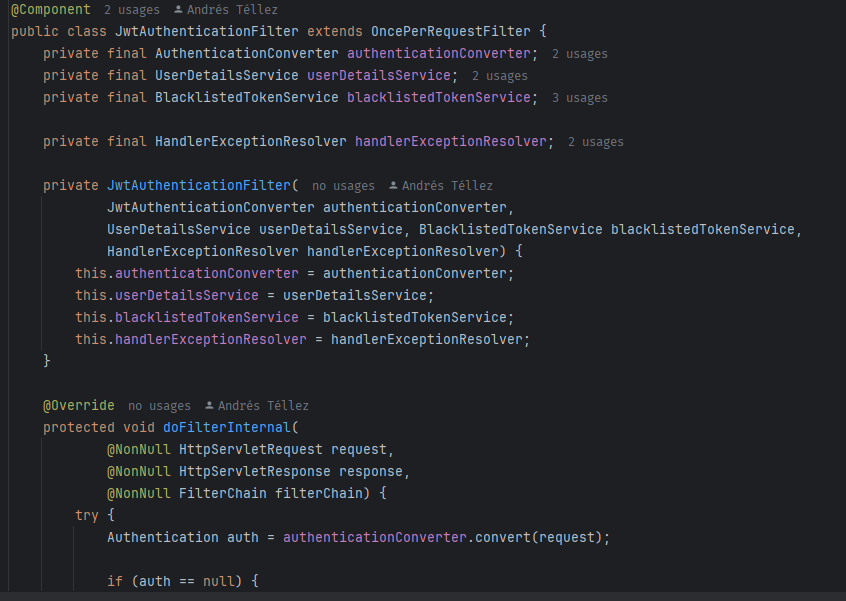
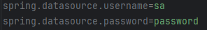

# Aplicación Bancaria en Spring Boot

## - Primera fase. Creación de entidades

* Se realizó la creación de entidades relevantes para la operación de la aplicación, descritas por 
el siguiente diagrama ER: <br/>

   <br />
  

---

## - Segunda fase (Capa de persistencia). Creación de repositorios con JPA

### Tecnologías utilizadas

* H2

---

* Se realizó la creación de repositorios Jpa para cada entidad generada en la fase anterior. <br />

   <br />

  

---

## - Tercera fase (Capa de tests). Creación de tests unitarios y de integración

### Tecnologías utilizadas

* JUnit
* Mockito
* MockMvc
* Jacoco

---

* Se implementaron los tests unitarios de la aplicación a las clases de servicios, como se puede
ver en el siguiente directorio. Para la realización de estas pruebas se utilizo JUnit y Mockito. <br />

   <br />
  


* Para ejecutar estos test puede ejecutarse el siguiente comando en una terminal:

```
./gradlew test
```

* Se incluyó una herramienta para el cubrimiento de código llamada jacoco, encargada de generar reportes sobre el 
cubrimiento de pruebas en la aplicación. Los reportes se pueden generar con el comando

```
./gradlew jacocoTestReport
```

* El reporte generado se podrá encontrar en la carpeta build/reports/jacoco/index.html

---

## - Cuarta fase (Capa de seguridad). Creación de filtros y configuración de Spring Security

### Tecnologías utilizadas

* Spring Security
* JWT

---

* Se implementó la seguridad con tokens JWT a través de la siguiente configuración de seguridad 
(la cual se puede encontrar en el paquete config): <br />

  


* En esta configuración se limitan las rutas protegidas, y se definen también aquellas rutas que siempre
son accesibles como las rutas de login, signup, y las relacionas a la consola de h2.


* Para la verificación de JWTs se implementó un filtro personalizado de Spring Security encargado de interceptar la 
petición y procesar el token, como se puede ver a continuación (este se encuentra en el paquete http/filters): <br />

  


* También se separó la logica de extracción del token en una clase por aparte, llamada JwtAuthenticationConverter.
Esta clase se puede encontrar en el paquete http/converters: <br />

  

---

## Inicialización de la Aplicación

Para iniciar la aplicación solo es necesario correr el siguiente comando en una terminal que se encuentre 
ubicada en el directorio raíz del proyecto

```
./gradlew bootRun
```

Al hacerlo, el proyecto estará disponible en la dirección localhost:8080. En caso de querer visualizar las tablas 
creadas, puede ingresar a la dirección localhost:8080/h2-console e iniciar una conexión con las credenciales 
especificadas en el archivo src/main/resources/application.properties.


